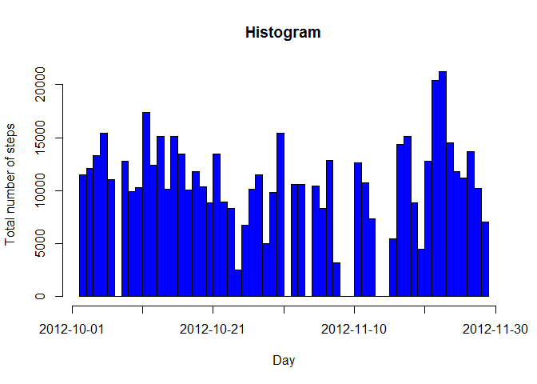
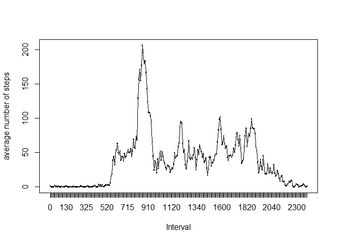
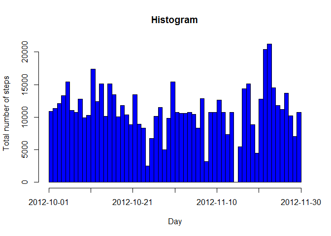
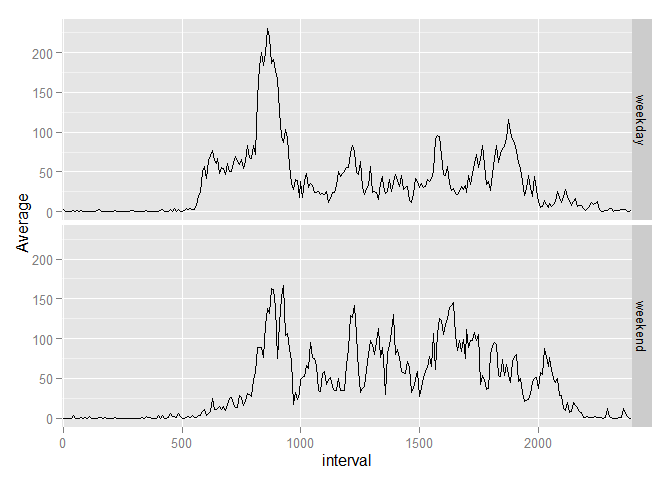

# Assignment One
##Intruduction 
It is now possible to collect a large amount of data about personal movement using activity monitoring devices such as a Fitbit, Nike Fuelband, or Jawbone Up. These type of devices are part of the "quantified self" movement - a group of enthusiasts who take measurements about themselves regularly to improve their health, to find patterns in their behavior, or because they are tech geeks. But these data remain under-utilized both because the raw data are hard to obtain and there is a lack of statistical methods and software for processing and interpreting the data.  

This report makes use of data from a personal activity monitoring device. This device collects data at 5 minute intervals through out the day. The data consists of two months of data from an anonymous individual collected during the months of October and November, 2012 and include the number of steps taken in 5 minute intervals each day.  

The variables included in this dataset are:  

-steps: Number of steps taking in a 5-minute interval (missing values are coded as NA)

-date: The date on which the measurement was taken in YYYY-MM-DD format

-interval: Identifier for the 5-minute interval in which measurement was taken

##Data Analysis

Let's load the data on the computer first. We are assuming that the data has been saved on the working directory. We are also going to call two libraries that we use during out analysis:


```r
main=read.csv("activity.csv")
library(plyr)
```

```
## Warning: package 'plyr' was built under R version 3.2.2
```

```r
library(ggplot2)
```

```
## Warning: package 'ggplot2' was built under R version 3.2.2
```
##Task One

The first task is to calculate the total number of steps taken per day and the make a histogram showing these information. The follown code is going to make this happen. Moreover it calculates the mean and the median of the total number of steps taken per day.


```r
sumation=ddply(main,.(date),summarize,sum=sum(steps,na.rm = T))
w=rep(sumation$date,sumation$sum)
hist(as.numeric(w),breaks=60,xaxt="n",col=4,xlab = "Day",ylab = "Total number of steps",main="Histogram")
c=seq(1,61,by=10)
axis(1,at=c,labels = sumation$date[c],las=1)
```

 

```r
mean=mean(sumation$sum)
median=median(sumation$sum)
```
According to out calculation the mean is 9354.2295082 and the median is 10395.

##Task Two
Now we want to focus on the time intervals. As we mentioned before the data is collected on the 5 minutes interval. We want to see what the average of number of steps is on each interval if we calculate it by going through all days.   
The next peice of code is designed to do this task. Moreover, we plot the time series graph of our calculation:


```r
interval=ddply(main,.(as.factor(interval)),summarize,aver=mean(steps,na.rm = T))
colnames(interval)[1]="interval"
plot(interval$interval,interval$aver,type = "l",xlab="Interval",ylab="average number of steps")
points(interval$interval,interval$aver,type = "l")
```

 

```r
max=max(interval$aver)
```
As you can see the maximum average is 206.1698113 which is contained in 8:35-8:40 interval.  

##Task Three
There are a number of days/intervals where there are missing values. The total number of missing values in the dataset is:

```r
total.number.missing.values=sum(is.na(main$steps))
print(total.number.missing.values)
```

```
## [1] 2304
```
Now we want to create a new database by replcaing the missing value occured on an interval on a day by the average of the number of steps on that interval calculated through all days( we calculate this average in the previous). 

```r
main1=main
for(i in 1:17568){
      if(is.na(main1$steps[i])){
             main1$steps[i]=interval$aver[grep(main1$interval[i],interval$interval)]
      }
}
```
Now we want to repeat task one for the new database, namely, main1:

```r
sumation1=ddply(main1,.(date),summarize,sum=sum(steps,na.rm = T))
w=rep(sumation1$date,sumation1$sum)
hist(as.numeric(w),breaks=60,xaxt="n",col=4,xlab = "Day",ylab = "Total number of steps",main = "Histogram")
c=seq(1,61,by=10)
axis(1,at=c,labels = sumation$date[c],las=1)
```

 

```r
newmean=mean(sumation1$sum)
newmedian=median(sumation1$sum)
```

The new mean and medians are:

```r
print(paste("NewMean=",newmean))
```

```
## [1] "NewMean= 10766.1886792453"
```

```r
print(paste("NewMedian=",newmedian))
```

```
## [1] "NewMedian= 10766.1886792453"
```

##Task Four  

Now we want to create a new factor variable in the dataset with two levels – “weekday” and “weekend” indicating whether a given date is a weekday or weekend day. We want to name this new variable to be "days". We are using the dataset with the filled-in missing values for this part. 


```r
date=as.Date(main1$date)
weekends=c("Saturday","Sunday")
days=vector()
for(i in 1:17568){
      if(weekdays(date[i])%in%weekends){
            days[i]="Weekend"
      }
      else{
            days[i]="Weekday"
      }
}
main1$days=days
```
Now we want to make a panel plot containing a time series plot of the 5-minute interval (x-axis) and the average number of steps taken, averaged across all weekday days or weekend days (y-axis). 


```r
weekend=main1[main1$days=="Weekend",]
weekday=main1[main1$days=="Weekday",]
interval.weekend=ddply(weekend,.(as.factor(interval)),summarize,aver=mean(steps,na.rm = T))
interval.weekday=ddply(weekday,.(as.factor(interval)),summarize,aver=mean(steps,na.rm = T))
main.interval=interval.weekday
main.interval$day=rep("weekday",288)
interval.weekend$day=rep("weekend",288)
main.interval=rbind(main.interval,interval.weekend)
colnames(main.interval)[1]="interval"
library(ggplot2)
ggplot(data=main.interval,aes(x=interval,y=aver,group=1))+geom_line()+facet_grid(facets = day~.)+scale_x_discrete(breaks=c(0,500,1000,1500,2000))+ylab("Average")
```

 
